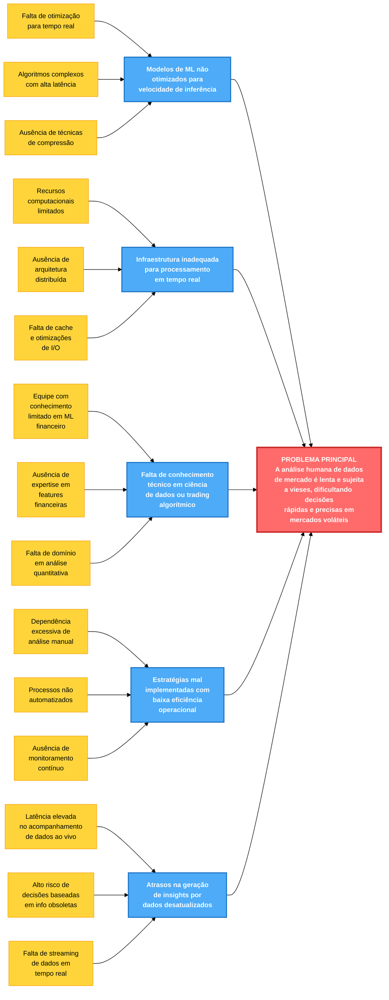

+++
date = '2025-10-20T00:37:30-03:00'
draft = true
title = 'Visão Do Produto'
+++
# 1. Visão do Produto (Fishbone)

## Diagrama de Ishikawa (Fishbone)

### Problema Principal
**A análise humana de dados de mercado é lenta e sujeita a vieses, dificultando decisões rápidas e precisas em mercados voláteis.**

### Análise de Causas Raiz

#### 📊 Modelos de ML
**Causa:** Modelos de ML não otimizados para velocidade de inferência
- Falta de otimização para processamento em tempo real
- Algoritmos complexos com alta latência
- Ausência de técnicas de compressão de modelos

#### 🏗️ Infraestrutura
**Causa:** Infraestrutura inadequada para processamento em tempo real
- Recursos computacionais limitados
- Ausência de arquitetura distribuída
- Falta de cache e otimizações de I/O
- Sistemas legados não escaláveis

#### 🎓 Conhecimento Técnico
**Causa:** Falta de conhecimento técnico em ciência de dados ou trading algorítmico
- Equipe com conhecimento limitado em ML aplicado a finanças
- Ausência de expertise em engenharia de features financeiras
- Falta de domínio em análise quantitativa

#### ⚙️ Processos Operacionais
**Causa:** Estratégias mal implementadas com baixa eficiência operacional
- Dependência excessiva de análise manual
- Processos não automatizados
- Falta de pipelines de dados estruturados
- Ausência de monitoramento contínuo

#### 📈 Qualidade dos Dados
**Causa:** Atrasos na geração de insights por dados desatualizados
- Latência elevada no acompanhamento de dados ao vivo
- Risco elevado de decisões baseadas em informações obsoletas
- Falta de streaming de dados em tempo real
- Problemas de sincronização entre fontes

---

## Visão do Produto

### O que é?
Uma plataforma inteligente de análise de mercado financeiro que utiliza Machine Learning para automatizar a análise de dados em tempo real, fornecendo insights acionáveis e reduzindo vieses humanos em decisões de trading.

### Para quem é?
- **Traders profissionais** que operam em mercados voláteis
- **Investidores institucionais** que necessitam de análise rápida e precisa
- **Instituições financeiras** que buscam automação e redução de risco

### Qual dor resolve?

#### Problema de Negócio
Traders, investidores e instituições financeiras que operam em mercados voláteis enfrentam:
- ⏱️ **Lentidão na análise:** Perda de oportunidades de lucro e aumento de risco
- 🧠 **Vieses humanos:** Decisões influenciadas por emoções e vieses cognitivos
- 📉 **Informações desatualizadas:** Alto risco de decisões baseadas em dados obsoletos

#### Impactos
- 💰 Perda de oportunidades de lucro em mercados de alta volatilidade
- ⚠️ Aumento de risco por decisões tardias ou imprecisas
- 📊 Decisões influenciadas por vieses humanos em vez de dados objetivos

#### Solução Proposta
Um sistema de ML que processa dados de mercado em tempo real, identificando padrões, gerando alertas automáticos e fornecendo recomendações baseadas em dados, permitindo:
- Decisões mais rápidas e precisas
- Redução de vieses através de análise objetiva
- Monitoramento contínuo e alertas proativos
- Automação de estratégias de trading

---

## Diagrama Fishbone (Ishikawa) - Mermaid

### Legenda do Diagrama
- 🔴 **Vermelho (Centro):** Problema Principal
- 🔵 **Azul:** Categorias de Causas Raiz (5 principais)
- 🟡 **Amarelo:** Subcausas específicas (3 por categoria)

---

## Métricas de Sucesso

### Objetivos Quantitativos
- ⚡ Reduzir tempo de análise de minutos para segundos (< 5s)
- 🎯 Acurácia de previsões > 75% em condições de mercado normal
- 📊 Redução de 40% em decisões baseadas em vieses humanos
- 🔄 Processamento de dados em tempo real com latência < 1s

### Objetivos Qualitativos
- Aumentar confiança dos traders nas decisões automatizadas
- Melhorar experiência do usuário com interface intuitiva
- Estabelecer transparência nos processos de decisão do modelo

---

*Última atualização: [Data]*
*Autores/Team: [Completar]*