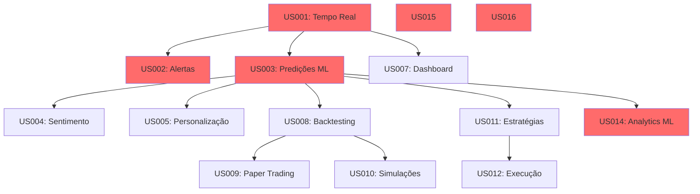

# 6. Priorização

## Técnica Utilizada: MoSCoW + ICE Score

Combinamos duas técnicas complementares:
- **MoSCoW:** Para categorização estratégica (Must/Should/Could/Won't)
- **ICE Score:** Para priorização dentro de cada categoria (Impact × Confidence × Ease)

### Fórmula ICE Score
```
ICE Score = (Impact × Confidence × Ease) / 3
```

Onde cada dimensão é avaliada em escala de 1-10:
- **Impact:** Valor de negócio e impacto no usuário
- **Confidence:** Confiança na estimativa e nos requisitos
- **Ease:** Facilidade de implementação (inverso da complexidade)

---

## Matriz de Priorização - User Stories

| ID | User Story | MoSCoW | Impact | Confidence | Ease | ICE Score | Sprint | Justificativa |
|----|------------|--------|--------|------------|------|-----------|--------|---------------|
| US001 | Monitoramento em Tempo Real | **MUST** | 10 | 9 | 5 | 8.0 | 1 | **Crítico:** Fundação do produto. Sem dados em tempo real, não há valor. Alto impacto, complexidade média em streaming. |
| US003 | Previsão de Direção | **MUST** | 10 | 7 | 4 | 7.0 | 3-4 | **Crítico:** Core do ML. Maior diferencial competitivo. Complexidade alta mas bem definida. |
| US015 | Gestão de Usuários | **MUST** | 8 | 9 | 7 | 8.0 | 21 | **Crítico:** Segurança e compliance. Tecnologia madura facilita implementação. Pode ser posterior ao MVP técnico. |
| US016 | Auditoria de Decisões | **MUST** | 9 | 8 | 6 | 7.7 | 22 | **Crítico:** Requisito regulatório. Essencial para conformidade com CVM. |
| US002 | Alertas de Movimentos | **MUST** | 9 | 8 | 7 | 8.0 | 2 | **Crítico:** Funcionalidade esperada. Relativamente simples após US001. |
| US014 | Analytics de Performance ML | **MUST** | 8 | 7 | 6 | 7.0 | 20 | **Crítico:** MLOps essencial. Sem isso, modelo degrada sem detecção. |
| US013 | Relatórios Automatizados | **SHOULD** | 7 | 8 | 8 | 7.7 | 19 | **Importante:** Melhora experiência, mas não bloqueia uso. Implementação direta. |
| US004 | Análise de Sentimento | **SHOULD** | 8 | 6 | 5 | 6.3 | 5 | **Importante:** Diferencial competitivo. Incerteza em acurácia do NLP. |
| US005 | Recomendações Personalizadas | **SHOULD** | 8 | 7 | 6 | 7.0 | 6 | **Importante:** Aumenta adesão de usuários conservadores. Depende de US003. |
| US007 | Dashboard Personalizável | **SHOULD** | 7 | 8 | 6 | 7.0 | 9 | **Importante:** Melhora UX significativamente. Poder users ativo. |
| US008 | Backtesting de Estratégias | **SHOULD** | 8 | 7 | 5 | 6.7 | 10-11 | **Importante:** Validação antes de capital real. Complexidade moderada-alta. |
| US006 | Consulta por Chat | **SHOULD** | 6 | 6 | 5 | 5.7 | 7-8 | **Desejável:** Legal para UX, mas não essencial. Incerteza em NLP conversacional. |
| US009 | Paper Trading | **COULD** | 7 | 7 | 6 | 6.7 | 12 | **Nice to have:** Educacional. Aproveita infraestrutura existente. |
| US010 | Simulação de Cenários | **COULD** | 7 | 6 | 4 | 5.7 | 13-14 | **Nice to have:** Valor para analistas de risco. Complexidade Monte Carlo. |
| US011 | Criação de Estratégias Auto | **COULD** | 9 | 5 | 3 | 5.7 | 15-17 | **Nice to have:** Alto valor mas muito complexo. Visual builder é desafiador. |
| US012 | Execução com Aprovação | **COULD** | 6 | 7 | 6 | 6.3 | 18 | **Nice to have:** Workflow específico. Depende de US011. |

---

## Análise por MoSCoW

### MUST HAVE (MVP) - 6 User Stories
**Total Story Points:** 83  
**Sprints:** 1-4, 20-22  
**Duração Estimada:** ~12 semanas

**Justificativa Estratégica:**
Este conjunto representa o **Produto Mínimo Viável** que entrega valor core aos stakeholders:
- ✅ Coleta e visualização de dados em tempo real (US001)
- ✅ Predições de ML funcionais (US003)
- ✅ Alertas proativos (US002)
- ✅ Monitoramento de saúde do modelo (US014)
- ✅ Segurança e auditoria (US015, US016)

**Riscos se não implementado:** Produto não é utilizável ou não atende compliance.

---

### SHOULD HAVE (Release 1.0) - 6 User Stories
**Total Story Points:** 91  
**Sprints:** 5-11, 19  
**Duração Estimada:** ~14 semanas

**Justificativa Estratégica:**
Funcionalidades que diferenciam significativamente o produto da concorrência:
- 📊 Análise multidimensional (sentimento, personalização)
- 🎨 Experiência do usuário superior
- 📈 Ferramentas de validação (backtesting)
- 📄 Automação de processos repetitivos

**Riscos se não implementado:** Produto funciona mas tem baixa adesão/competitividade.

---

### COULD HAVE (Releases Futuras) - 4 User Stories
**Total Story Points:** 113  
**Sprints:** 12-18  
**Duração Estimada:** ~14 semanas

**Justificativa Estratégica:**
Features avançadas para usuários sofisticados:
- 🎓 Ferramentas educacionais (paper trading)
- 🤖 Automação completa (estratégias algorítmicas)
- 📊 Analytics avançado (simulações)

**Riscos se não implementado:** Perda de usuários avançados para concorrentes especializados.

---

## Matriz GUT (Gravidade × Urgência × Tendência)

Análise complementar para features técnicas/infraestrutura:

| Item | Gravidade | Urgência | Tendência | GUT Score | Prioridade |
|------|-----------|----------|-----------|-----------|------------|
| **Infraestrutura Tempo Real** | 10 | 10 | 10 | 1000 | Crítica |
| **Pipeline de ML** | 10 | 9 | 9 | 810 | Crítica |
| **Segurança/Compliance** | 10 | 8 | 8 | 640 | Crítica |
| **Monitoramento/Observability** | 8 | 9 | 9 | 648 | Alta |
| **Feature Store** | 7 | 8 | 8 | 448 | Alta |
| **API REST** | 7 | 7 | 7 | 343 | Média |
| **Otimização de Latência** | 6 | 6 | 8 | 288 | Média |
| **Mobile App** | 5 | 4 | 7 | 140 | Baixa |

**Escala:**
- **Gravidade:** Impacto se não resolvido (1-10)
- **Urgência:** Tempo até se tornar crítico (1-10)
- **Tendência:** Probabilidade de piorar (1-10)

---

## Roadmap Visual

```
═══════════════════════════════════════════════════════════════════
                          ROADMAP 2025-2026
═══════════════════════════════════════════════════════════════════

Q1 2025 │ MVP (MUST HAVE)
────────┼─────────────────────────────────────────────────────────
Sprint  │ US001: Monitoramento Tempo Real ████████████░░░░░░░
  1-2   │ US002: Alertas                  ░░░░░░░░████████░░░
────────┼─────────────────────────────────────────────────────────
Sprint  │ US003: Predições ML             ██████████████████░░
  3-4   │ RML001-009: Pipeline ML         ██████████████████░░
────────┼─────────────────────────────────────────────────────────

Q2 2025 │ RELEASE 1.0 (SHOULD HAVE)
────────┼─────────────────────────────────────────────────────────
Sprint  │ US004: Sentimento               ████████░░░░░░░░░░░
  5-6   │ US005: Personalização           ░░░░░░░░████████░░░
────────┼─────────────────────────────────────────────────────────
Sprint  │ US006: Chat                     ██████████████████░░
  7-9   │ US007: Dashboard Custom         ░░░░░░░░░░██████████
────────┼─────────────────────────────────────────────────────────
Sprint  │ US008: Backtesting              ██████████████████░░
 10-11  │
────────┼─────────────────────────────────────────────────────────

Q3 2025 │ ADVANCED FEATURES (COULD HAVE)
────────┼─────────────────────────────────────────────────────────
Sprint  │ US009: Paper Trading            ████████░░░░░░░░░░░
 12-14  │ US010: Simulações               ░░░░░░░░██████████░░
────────┼─────────────────────────────────────────────────────────
Sprint  │ US011: Estratégias Auto         ██████████████████████████
 15-17  │                                 ░░░░░░░░░░░░░░░░░░
────────┼─────────────────────────────────────────────────────────

Q4 2025 │ GOVERNANCE & POLISH
────────┼─────────────────────────────────────────────────────────
Sprint  │ US012: Execução c/ Aprovação    ████████░░░░░░░░░░░
 18-19  │ US013: Relatórios               ░░░░░░░░████████░░░
────────┼─────────────────────────────────────────────────────────
Sprint  │ US014: Analytics ML             ████████░░░░░░░░░░░
 20-22  │ US015: Gestão Usuários          ░░░░░░░░████████░░░
        │ US016: Auditoria                ░░░░░░░░░░░░████████
────────┼─────────────────────────────────────────────────────────
```

---

## Dependências Entre User Stories



**Legenda:**
- 🔴 Vermelho: MUST HAVE (MVP)
- 🟡 Amarelo: SHOULD HAVE
- 🟢 Verde: COULD HAVE

---

## Critérios de Decisão

### Por que esta priorização?

#### 1. Value Stream Mapping
Identificamos o fluxo de valor crítico:
```
Dados → Processamento → Predição → Decisão → Ação
```

Priorizamos US que completam este fluxo end-to-end primeiro.

#### 2. Risk Mitigation
Atacamos riscos técnicos cedo:
- **Sprint 1-4:** Validar streaming, ML pipeline, latência
- Permite pivot se necessário

#### 3. Feedback Loops
MVP permite feedback real de usuários em ~3 meses:
- Validação de hipóteses de negócio
- Ajuste de roadmap baseado em uso real

#### 4. Compliance First
US015/US016 são posteriores tecnicamente, mas críticas para go-live:
- Podem ser desenvolvidas em paralelo
- Bloqueantes para produção

---

## Trade-offs Considerados

| Decisão | Alternativa Descartada | Justificativa |
|---------|------------------------|---------------|
| MoSCoW + ICE | Apenas MoSCoW | ICE adiciona granularidade numérica |
| Chat como SHOULD | Chat como MUST | UX legal, mas não core value |
| Automação como COULD | Automação como MUST | Alta complexidade, nicho específico |
| US015/US016 no fim | Segurança desde Sprint 1 | Pode ser implementado em paralelo ao MVP técnico |
| Backtesting antes de Paper Trading | Inverter ordem | Backtesting valida estratégias antes de simulação |

---

## Métricas de Sucesso por Fase

### MVP (MUST HAVE)
- ✅ Sistema processa dados com < 1s latência
- ✅ Modelo atinge 70%+ acurácia
- ✅ 10 usuários beta conseguem operar
- ✅ Zero incidentes de segurança
- ✅ 100% das decisões auditáveis

### Release 1.0 (SHOULD HAVE)
- ✅ NPS > 50
- ✅ 100+ usuários ativos
- ✅ 80% dos usuários usam personalização
- ✅ Backtests mostram consistência do modelo
- ✅ Tempo médio na plataforma > 30min/dia

### Advanced Features (COULD HAVE)
- ✅ 20+ estratégias automatizadas criadas
- ✅ Paper trading com Sharpe > 1.0
- ✅ 50% dos power users usam simulações
- ✅ Redução de 40% em tempo de análise

---

## Revisão de Priorização

**Frequência:** Bimestral (a cada 4 sprints)

**Triggers para repriorização:**
- Mudança regulatória urgente
- Feedback crítico de usuários
- Descoberta técnica que invalida premissas
- Movimento competitivo significativo
- Mudança de estratégia da empresa

**Responsáveis:**
- Product Owner (decisão final)
- Tech Lead (viabilidade técnica)
- Stakeholders (validação de valor)

---

*Última atualização: [Data]*  
*Próxima revisão: [Data + 2 meses]*  
*Aprovado por: [Product Owner]*